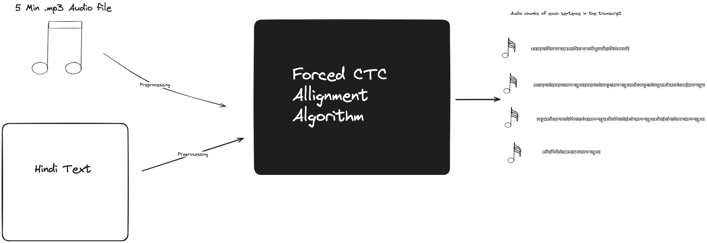
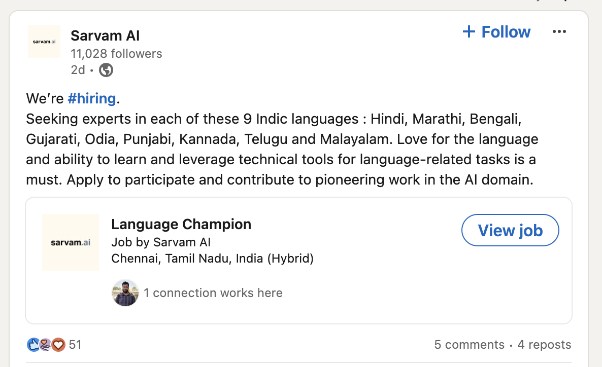
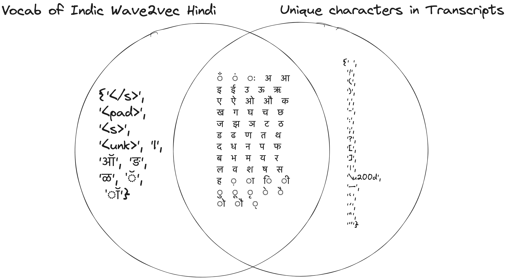

# Forced CTC allignment for Indic languages (Hindi)
##### This is code for [hiring challenge](https://colab.research.google.com/drive/1EiiLTf5zB8Jm2PxdU3H20rWUr40FrsGM?usp=sharing) for Sarvam AI Speech team, [linkedin post](https://www.linkedin.com/posts/sarvam-ai_sarvam-ai-activity-7195640684052197378-PfEt?utm_source=share&utm_medium=member_desktop)



Allignment is problem frequently seen in Text-to-speech or speech-to-text tasks where we need to accurately map text to its phonetic representation in the audio. 

Simply speaking we need the starting and ending timestamp of every word in the transcript of when it is spoken in the audio. (These timestamps can be on a character basis as well and on sentence level as well, depending on the use case)
Note that for forced allignement, we need to already have the transcript of the audio file. 

This problem becomes difficult for Indic languages for a couple of reasons
- as we dont have strong foundational audio models for all Indic languages. Here I have used Wave2vec2-Hindi trained by ai4bharat to perform allignment on the data I scraped from a public website. 
- effective tokenization is difficult for Indic languages.

## Dataset 
[](https://www.kaggle.com/datasets/nishantbhansali/new-testament-readings-in-hindi-260-chapters)

This dataset contains 
- Chapter wise audio recordings of the New Testament (260 chapters). Files in .mp3 format. Language is Hindi
- Their corresponding transcripts in Hindi Language.

This data was scraped from the website www.faithcomesbyhearing.com
This dataset was uploaded to Kaggle for easy viewing and for the community to use.

I downloaded the audio files manually and used a script to extract the text for each of the audio recordings. I used [this file](https://github.com/nishantb06/sarvam/blob/main/part2/scraping_final.ipynb) to scrape the text off of the website and clean  up the text, (removing trailing whitespaces, removing unnecessary line breaks and numbers etc.). The final cleaned text is present in the kaggle dataset as well. 

### Problem with the dataset and how to solve it.
To make the dataset usable for technologies like speech to text and text to speech models, we need the audio-text pairs in a certain manner. 
1. Each audio file cannot be more than 30 second in length. If we make the audio file too long we will have trouble fitting them into the memory of the GPU!!
2. We should segment the text such that each sentence is said out loud in the corresponding audio file. Which means the problem again becomes that of alignment. **We need the starting and ending timestamp of each word present in the transcript**. Dividing the entire transcript becomes easy as we can do so by simply the *purna viram* character (Full stop equivalent in Hindi). Question marks and exclamation marks are a good way to segregate the sentences. 
3. If we are not able to do this then we would have to spend time and money on manual annotators to get this job done. Job postings like this would be unnecessary.

4. I have solved this problem by using forced alignment with Indiv Wave2vec model trained on Hindi language by AI4Bharat. 
5. To do this the basic steps are:
	1. Clean up the text so that there are no trailing spaces or unnececessat numbers or white spaces. 
	2. Divide the entire transcript into sentences. Can be identified by full stop, question mark or exclamation mark.
	3. Normalize the text such that chandra bindu, halant and other special characters in the Hindi language dont bother you.  I used Kurian Benoy's [Whisper normalisation](https://github.com/kurianbenoy/whisper_normalizer/tree/main) package to do this. For more reading refere this ([Normalisation of text for Indian Languages and why the whisper speech model fails](https://kavyamanohar.com/post/indic-normalizer/))
	4. The most important thing to note is that you cant have any characters in the transcript which are not in the vocab of Indic Wave2vec. This is for a straightforward reason. 
    
	5. After doing this it is important to remove any whitespace in the transcript and replace it with the blank token. The index of blank token should be 0 in our labelset for the forced allignment algorithm to work effectively. This is becuase ASR model predict the presence of this blank token and not the usual whitespace character so that recurring characters can be mapped to their phonetic representation as well. Text to be fed into the algorithm should look something like this. 
    ```
    |अब्राहम|की|सन्तान|दाऊद|की|सन्तान|यीशु|मसीह|की|वंशावली|अब्राहम|से|इसहाक|उत्पन्न|हुआ|इसहाक|से|याकूब|उत्पन्न|हुआ|और|याकूब|
    ```
	6. Feed the entire audio file and the transcript together into the model. After passing though the eniter CTC algorithm we will get the starting and ending timestamp of each word. After some logical statements and mapping with sentence breakdown that we had done already in the past we can get the starting and ending timestamp of each sentence and thus slice the original 5 minute audio file into chunks of 10 second (on average). These chunks are sure to have meaningful text written in them. 
	7. Note that we should save these audio chunks with a sampling rate of 16k and in mono (single channel) format becuase thats what we train TTS and STT models on. 
    8.  Correspodning file to do all these steps is [here](part2/allignment_utils.py)


